# Contacts

A cross-platform Flutter contacts manager with Google Sign-In, cloud sync via Firebase, and offline-first local storage. Manage your contacts on Android and iOS with search, favorites, and quick actions like call, SMS, and email.

**Note:** Firebase-related files are included in this source code repository. I understand that committing these files is not considered a best practice. However, they have been included intentionally so that interviewers can easily set up and run the project without any additional configuration.

APK Dowlonad: https://drive.google.com/file/d/1R2Y_NZMkYUfJOKlX3xs4jDCPKluqsADT/view?usp=sharing

## Features

### Authentication & sync

- **Google Sign-In** — Sign in with your Google account using Firebase Authentication.
- **Cloud backup** — Contacts are stored in Cloud Firestore under `users/{uid}/contacts`.
- **Offline-first** — All contacts are cached locally in SQLite (sqflite). Changes save locally first and sync to the cloud when online.
- **Automatic restore** — On sign-in or app launch, remote contacts are downloaded and merged into the local database.
- **Pending sync** — Unsynced local changes are pushed to Firestore automatically when connectivity is restored.

### Contact management

- **View contacts** — Alphabetically grouped list with section headers (A–Z and `#` for other).
- **Search** — Real-time search with debounced filtering.
- **Alphabet scroll bar** — Jump quickly to any letter in the list.
- **Add & edit** — Create or update contacts with:
  - First name, last name, nickname
  - Phone (with country picker and validation)
  - Email
  - Company, job title, department
  - Birthday
  - Notes
- **Contact details** — Full profile view with avatar, work info, websites, and notes.
- **Quick actions** — Call, SMS, and email directly from the contact detail screen.
- **Copy to clipboard** — Long-press phone or email on the detail screen to copy.
- **Delete** — Remove contacts from the detail screen, via swipe, or in bulk from Settings.
- **Undo delete** — Snackbar with undo after deleting a contact from the list.

### Favorites

- **Star contacts** — Mark contacts as favorites from the list (swipe right) or detail screen.
- **Favorites tab** — Grid view of starred contacts with one-tap call.
- **Remove favorite** — Long-press a favorite card to unstar.

### Settings

- **Theme** — System, light, or dark mode.
- **Account info** — View signed-in Google profile (name, email, photo).
- **Storage info** — See total contact count on device.
- **Delete all contacts** — Permanently remove all local contacts (with double confirmation).
- **Sign out** — Sign out of Google and clear local contacts from the device.

### UI & UX

- Material Design 3 theming with light and dark support.
- Pull-to-refresh on contacts and favorites lists.
- Swipe actions on contact list items (delete left, favorite right).
- Responsive layout utilities.
- Form validation for names, email, phone, and birthday.

## Screenshots

### Authentication & Registration

<div align="center">
  <table>
    <tr>
      <td align="center">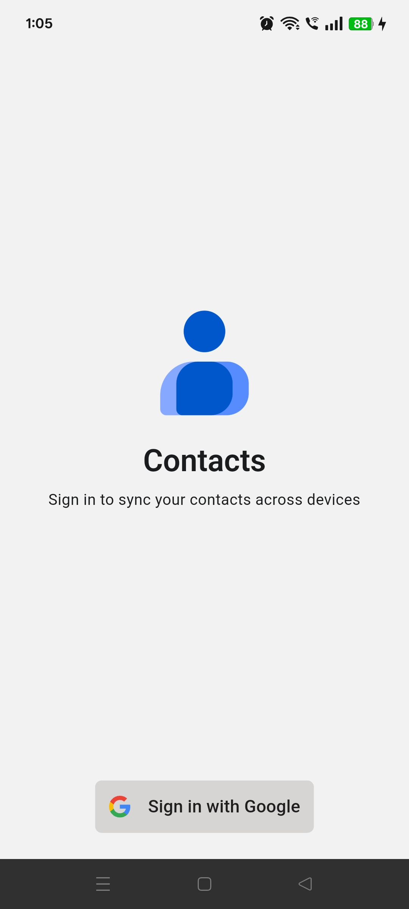<br /><sub><b>Sign In Page</b></sub></td>
      <td align="center">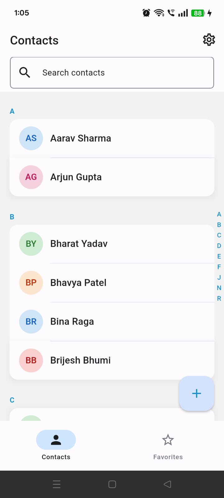<br /><sub><b>Contacts Tab</b></sub></td>
      <td align="center">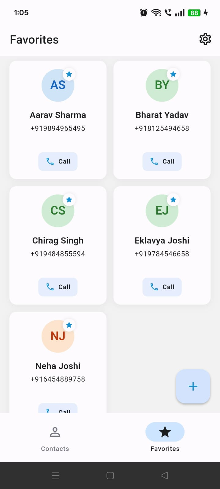<br /><sub><b>Favorites Tab</b></sub></td>
    </tr>
    <tr>
      <td align="center">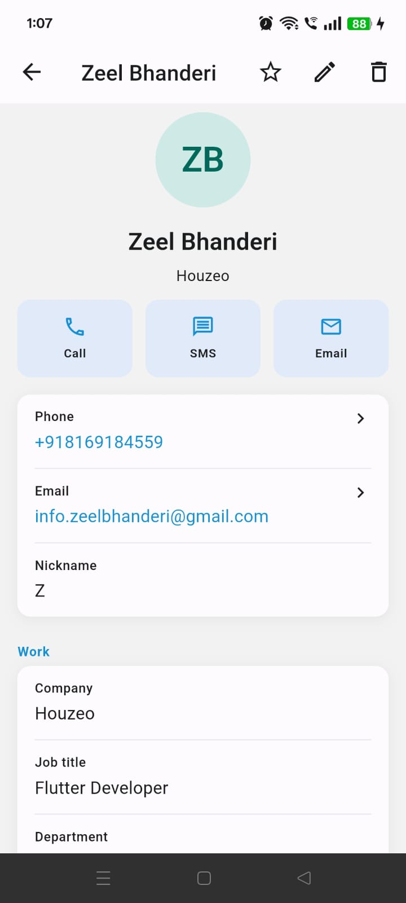<br /><sub><b>Contact Details</b></sub></td>
      <td align="center">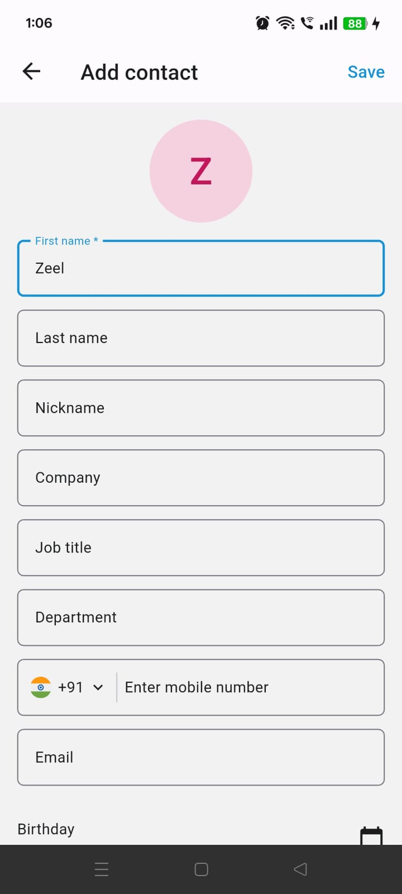<br /><sub><b>Contacts Form</b></sub></td>
      <td align="center">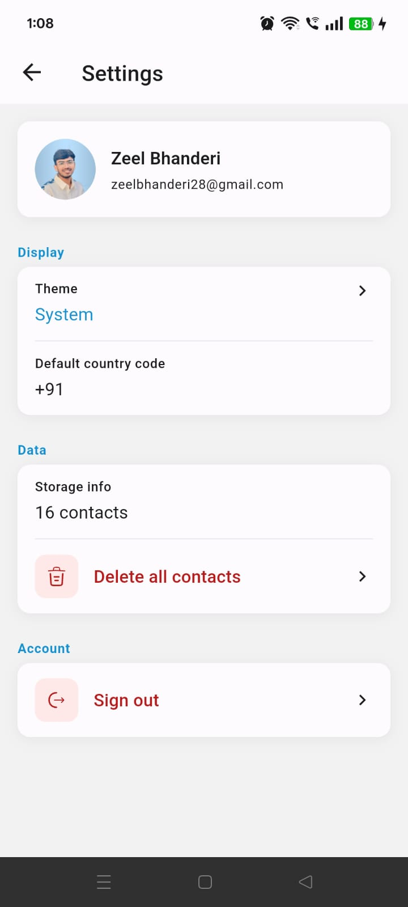<br /><sub><b>Settings Page</b></sub></td>
    </tr>
    <tr>
      <td align="center">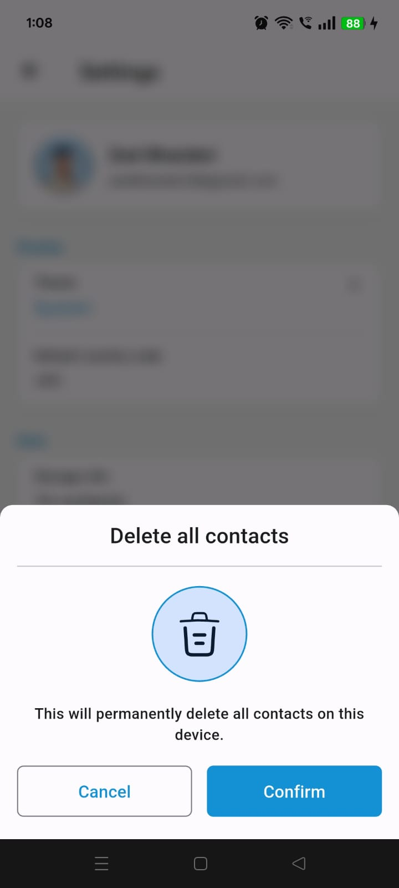<br /><sub><b>Delete All Contacts 1</b></sub></td>
      <td align="center">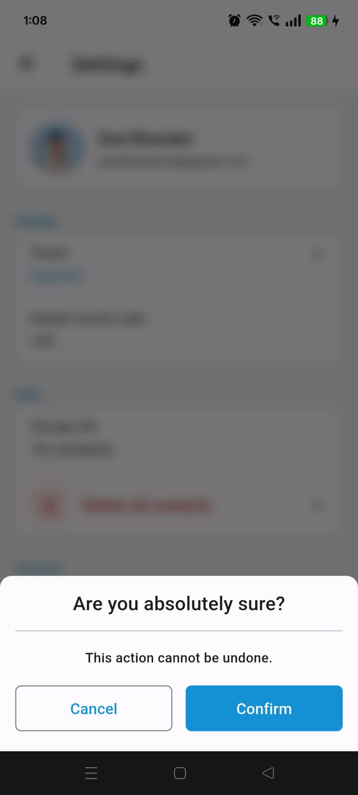<br /><sub><b>Delete All Contacts 2</b></sub></td>
      <td align="center">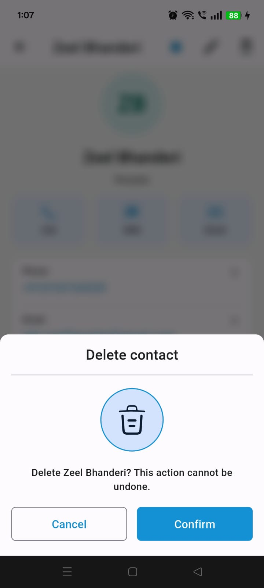<br /><sub><b>Delete Contacts</b></sub></td>
    </tr>
    <tr>
      <td align="center">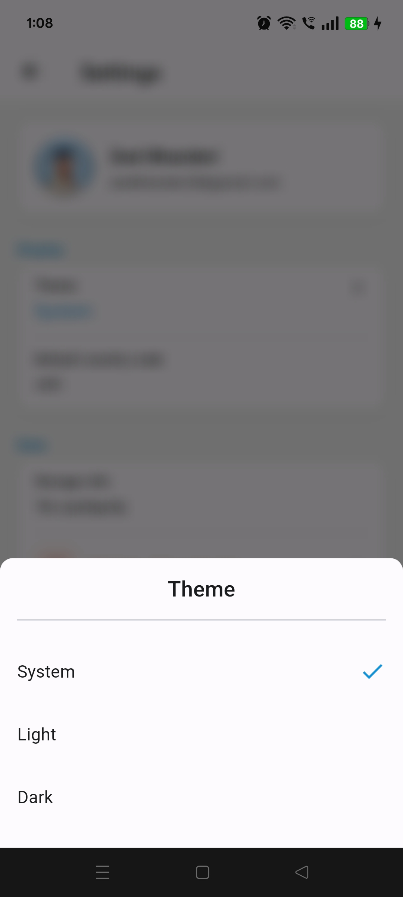<br /><sub><b>Theme Change</b></sub></td>
      <td align="center">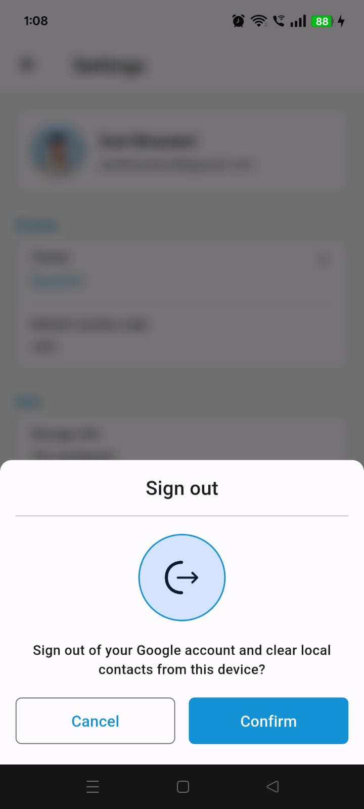<br /><sub><b>Sign Out</b></sub></td>
    </tr>
  </table>
</div>

## Getting Started

To get a local copy up and running, follow these simple steps.

### Prerequisites

- **Flutter SDK**: Make sure you have Flutter installed on your development machine. [Installation Guide](https://flutter.dev/docs/get-started/install)
- **Dart SDK**: Included with Flutter, but ensure it’s up-to-date.

### Installation

1. Clone the repository:

   ```bash
   git clone https://gitlab.com/lakeocean-technology/lakeocean-mobile/flutter/projects/noorah-app.git
   cd noorah-app
   ```

2. Install dependencies:

   ```bash
   flutter pub get
   ```

3. Run the app on your preferred device:

   ```bash
   flutter run
   ```

### Deployment

1. Build APK for Android:

   ```bash
   flutter build apk
   ```

2. Build App Bundle for Google Play Store:

   ```bash
   flutter build appbundle
   ```

## Technologies Used

| Layer            | Technology                                                                                                                                                          |
| ---------------- | ------------------------------------------------------------------------------------------------------------------------------------------------------------------- |
| Framework        | Flutter (3.35.5) - Dart SDK ( 3.9.2 ) UI toolkit for building natively compiled applications.                                                                       |
| State management | [GetX](https://pub.dev/packages/get) : State management, route management, and dependency injection. (HR said I can choose any state management solution I prefer.) |
| Local database   | [sqflite](https://pub.dev/packages/sqflite)                                                                                                                         |
| Cloud            | Firebase Auth, Cloud Firestore                                                                                                                                      |
| Sign-in          | Google Sign-In                                                                                                                                                      |
| Architecture     | Clean architecture (domain / data / features)                                                                                                                       |

### Run code generation (optional)

If you modify annotated models or assets:

```bash
fvm dart pub run build_runner build --delete-conflicting-outputs
```

### Run the app

**Android**

```bash
fvm flutter run
```

**iOS**

```bash
cd ios && pod install && cd ..
fvm flutter run
```

**Release build**

```bash
fvm flutter build apk        # Android APK
fvm flutter build appbundle  # Android App Bundle
fvm flutter build ios        # iOS
```

## App Workflow

The Contacts application follows a this user structured workflow:

### Sign in

1. Launch the app.
2. On the sign-in screen, tap **Sign in with Google**.
3. Choose your Google account and grant permissions.
4. The app restores your contacts from the cloud, then opens the home screen.

If you are already signed in, the app skips sign-in and syncs contacts on launch.

### Browse contacts

1. The **Contacts** tab shows all contacts grouped alphabetically.
2. Use the search bar at the top to filter by name, phone, email, or other fields.
3. Drag the alphabet index on the right to jump to a letter.
4. Pull down to refresh the list.
5. Tap a contact to open their detail page.

### Add a contact

1. Tap the **+** floating action button on the home screen.
2. Fill in the contact form (first name is required and phone number is required).
3. Tap **Save**.

The contact is saved locally and synced to Firestore when online if device online directly synced.

### Edit or delete a contact

**From the contact detail screen:**

- Tap the **star** icon to toggle favorite.
- Tap the **edit** icon to update fields.
- Tap the **delete** icon to remove the contact.
- Use **Call**, **SMS**, or **Email** buttons for quick actions.

**From the contacts list:**

- Swipe **left** to delete (with undo option).
- Swipe **right** to favorite or unfavorite.

### Favorites

1. Open the **Favorites** tab in the bottom navigation bar.
2. Tap a card to view the contact.
3. Tap **Call** on a card if a phone number is available.
4. Long-press a card to remove it from favorites.

### Settings

1. Tap the **gear** icon in the app bar.
2. **Theme** — Choose System, Light, or Dark.
3. **Storage info** — View how many contacts are stored locally.
4. **Delete all contacts** — Remove every contact from this device (requires two confirmations). Remote contacts in Firestore are not deleted by this action alone when online sync is active; sign-out clears local data.
5. **Sign out** — Signs out of Google and clears local contacts from the device.

## Project structure

```text
lib/
├── app/              # App entry, routes, themes
├── core/             # Shared utilities, widgets, DI, services
├── data/             # Models, local/remote datasources, repositories
├── domain/           # Entities, repository interfaces, use cases
├── features/         # UI by feature (auth, contacts, favorites, settings, etc.)
├── gen/              # Generated assets
└── l10n/             # Localization
```

## License

This project is not published to pub.dev (`publish_to: 'none'`). See the repository owner for license terms.
